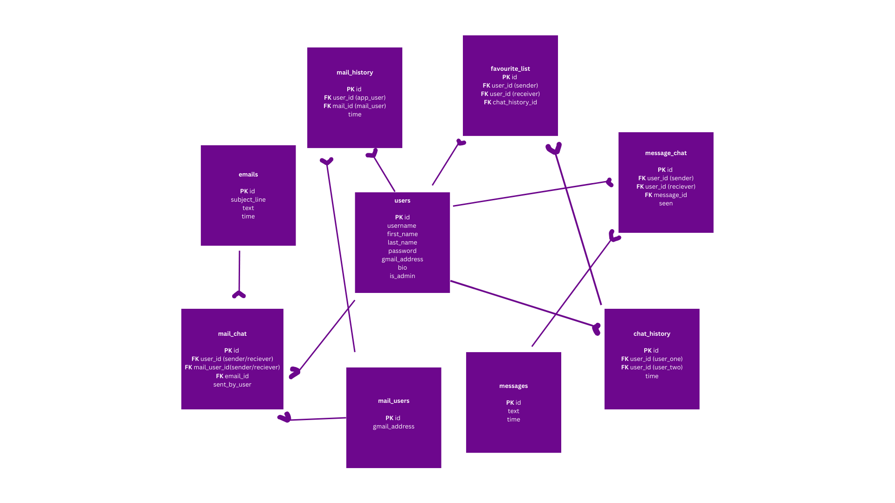
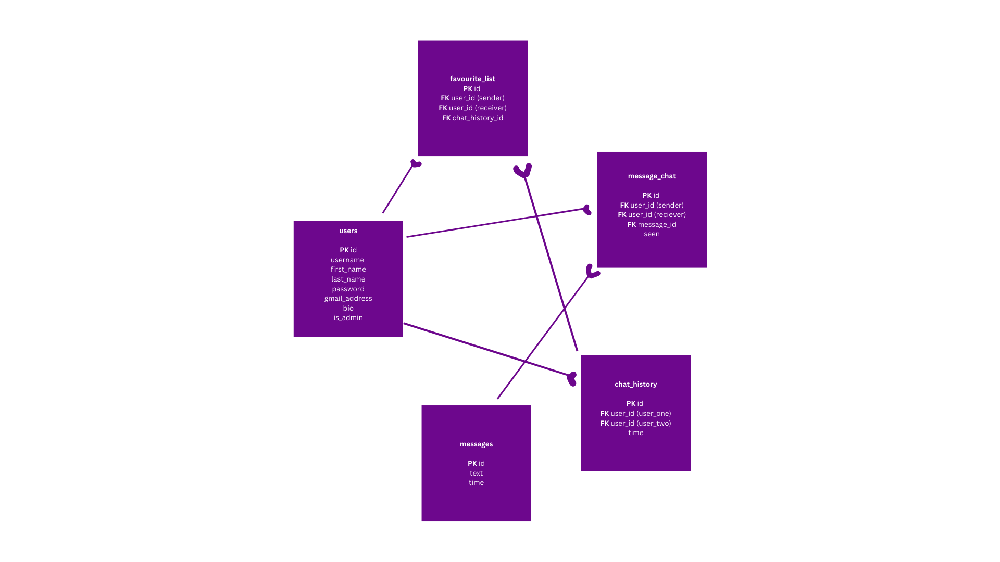

# Chat App -FRONT END README.md

I have broken down the Marvel App Project into easy-to-follow steps. Here’s a quick overview of what I did for each step of your capstone project.

1. Step One: Initial Project Ideas: I’ll pick up to 3 project ideas to propose to my mentor and the Springboard community. I’ll also explore some potential APIs.
2. Step Two: Project Proposal: For this step, I’ll write a proposal for the site I want to build. This will help my mentor better understand my chosen capstone project idea.
3. Step Three: Schema Design and API Selection: After my mentor approves of my capstone project proposal, I’ll figure out the database design of my application and which API I’ll be using.
4. Step Four: Coding User Flows: Once I’ve figured out what I’m building, I’ll write the code to implement it. It’s important to think about what I want a user’s experience to be like as they navigate my site.
5. Step Five: Polishing My Application: Once I have the core functionality implemented, I’ll focus on additional UI enhancements and styling for my application.
6. Step Six: Documenting and Submission: I’ve done a lot of work so now it’s time to show my mentor my progress! Create a README in markdown, make sure my GitHub is organized, and submit my finalized project.

## Database Design

### All the tables created for the backend include:

### Tables utilized by the front-end include:

## Overview

Initially, my goal was to build a powerful application that allowed users to manage their emails, including sending bulk emails via the chat app, along with supporting basic messaging features between users.  
However, due to the complexity of the Google API, I decided to exclude the Google API and focus entirely on the chat functionality. As a result, the app was designed for real-time communication, enabling users to chat with each other without needing to refresh the browser.

### Features

- Account Creation: Users can sign up to create their own accounts, enabling a personalized experience.
- Login/Logout Functionality: Secure mechanisms ensure that users' information is individually managed and protected during login and logout.
- Search Functionality: An integrated search bar allows users to easily find others they are interested in chatting with.
- Live Communication: Real-time messaging ensures users don't need to refresh the page to send or receive messages.
- Message Read Status: Users can see if their messages have been read without needing to refresh the page.
- Favorite List: Users can add others to their favorite list for quick access.
- Emoji Support: A variety of emojis are available to enhance the chat experience.

### User Flow

- Users can log in or sign up (if they haven't) for the app.
- On the homepage, users can choose to chat with their favourite people or new people.
- Users can find other users by using the search box.
- Users can visit others' profiles.
- Users can add other people to their favourite list.
- Users can update their bio information on their personal page.
- Users can chat with other people live, with emojis available.

## Tech Stack

**Back-end**

- JavaScript
- Node, Express
- PostgreSQL, Node-pg
- Bcrypt
- JSON web tokens (JWT)
- JSON Schema
- Render
- RESTful APIs
- Socket.io

**Front-end**

- HTML, CSS
- Redux
- REACT
- Socket.io

**Testing**

- Jest

## How to set up and run the project

0. Clone this project from GitHub to your machine.
1. Download [npm and Node.js](https://docs.npmjs.com/downloading-and-installing-node-js-and-npm) to your machine.
2. Open a terminal and navigate to the `backend/` directory. Run `npm install` to install all the required packages for the backend.
3. In the terminal, navigate to the `client/vite-project/` directory. Run `npm install` to install all the required packages for the frontend.
4. Create 2 databases in your postgreSQL, name them as `chat_app_test` and `chat_app`.
5. Go to chat_app backend `config.js` and the change the database password to your postgreSQL database password.
6. In the terminal, navigate to the `backend/` directory. Run `npm start` to start the API server.
7. In the terminal, navigate to the `client/vite-project/` directory. Run `npm run dev` to start the client server.
8. To work with the app API in the backend, use an application like Insomnia. The API is available at: `http://localhost:8000`.
9. To see how the whole application works (front-end and back-end), open a web browser and go to `http://localhost:5173/`.
10. If you want to deploy this app to Vercel, add this ENV variables

- VITE_BASE_URL

## Testing

For testing, it is recommended to turn off both the API server and the client server to prevent unnecessary errors.

- In the terminal, navigate to the `backend/` directory. Run `npm run test` to test the API server.
- In the terminal, navigate to the `client/vite-project/` directory. Run `npm run test` to test the client server.

You can choose either test individual test file or all files at once. It will take a short amount of time to test all the files. The `BCRYPT_WORK_FACTOR` has been set from 12 to 1 in the testing environment to make the tests run faster.

## Ideas for Future App Improvements

- Add a suggestion list when users search for people to chat with.
- Implement email and calling features (requires a paid Google API plan).

## Deployed Link

[Front-end link](https://github.com/connertran/chat_app_front_end_capstone_project2_render)  
[Back-end link](https://github.com/connertran/chat_app_back_end_capstone_project2_render)
[Deployed Link](https://chat-app-front-end-pi-green.vercel.app/)
